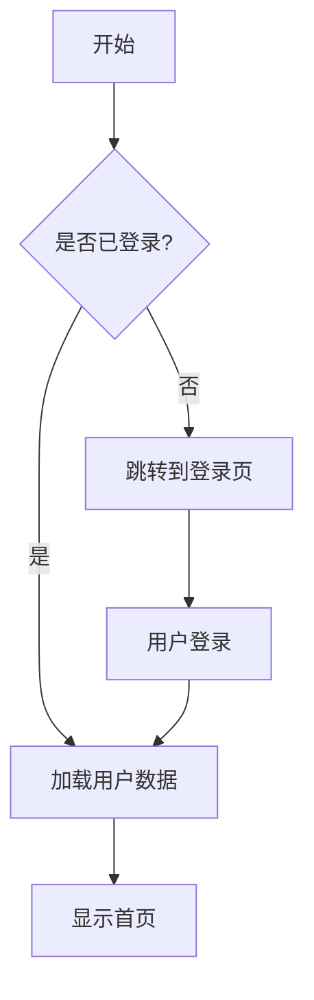
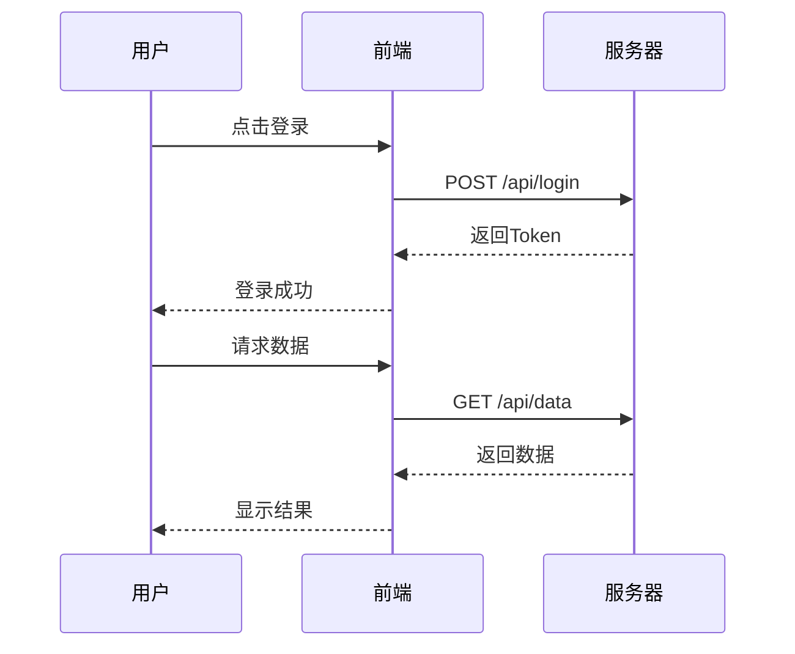

# 功能测试文档

## KaTeX 数学公式

### 内联公式
爱因斯坦的质能方程 $E = mc^2$ 是物理学中最著名的公式。

二次方程求根公式：$x = \frac{-b \pm \sqrt{b^2 - 4ac}}{2a}$

欧拉公式：$e^{i\pi} + 1 = 0$

### 显示公式
$$
\frac{d}{dx} \left( \int_{a}^{x} f(t) dt \right) = f(x)
$$

$$
\sum_{n=1}^{\infty} \frac{1}{n^2} = \frac{\pi^2}{6}
$$

## 语法高亮

### JavaScript
```javascript
function fibonacci(n) {
  if (n <= 1) return n;
  const dp = [0, 1];
  for (let i = 2; i <= n; i++) {
    dp[i] = dp[i - 1] + dp[i - 2];
  }
  return dp[n];
}

console.log(fibonacci(10)); // 55
```

### Python
```python
import numpy as np
from typing import List

def quick_sort(arr: List[int]) -> List[int]:
    if len(arr) <= 1:
        return arr
    pivot = arr[len(arr) // 2]
    left = [x for x in arr if x < pivot]
    middle = [x for x in arr if x == pivot]
    right = [x for x in arr if x > pivot]
    return quick_sort(left) + middle + quick_sort(right)
```

### CSS
```css
.container {
  display: grid;
  grid-template-columns: repeat(3, 1fr);
  gap: 16px;
  padding: 20px;
}

.card {
  background: linear-gradient(135deg, #667eea 0%, #764ba2 100%);
  border-radius: 12px;
  transition: transform 0.3s ease;
}

.card:hover {
  transform: translateY(-4px);
  box-shadow: 0 8px 24px rgba(0, 0, 0, 0.15);
}
```

## Mermaid 图表

### 流程图


### 时序图


## 表格

| 功能 | 状态 | 优先级 |
|:-----|:----:|:------:|
| KaTeX 数学公式 | ✅ 已完成 | 高 |
| 语法高亮 | ✅ 已完成 | 高 |
| Mermaid 图表 | ✅ 已完成 | 高 |
| 文档目录 | ✅ 已完成 | 高 |

## 代码块自动检测

```
const greeting = "Hello, World!";
const numbers = [1, 2, 3, 4, 5];
const doubled = numbers.map(n => n * 2);
console.log(greeting, doubled);
```
